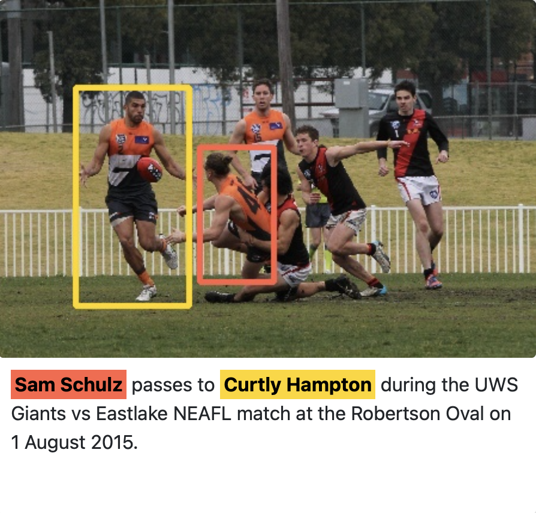
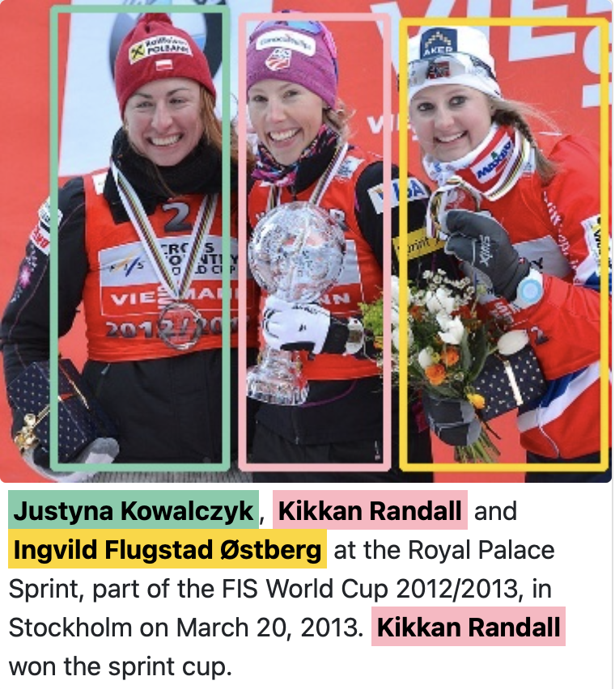

# Who's Waldo? Linking People Across Text and Images
Download links and PyTorch implementation of "Who's Waldo? Linking People Across Text and Images", ICCV 2021.
> Who's Waldo? Linking People Across Text and Images
>
> [Claire Yuqing Cui*](https://github.com/clairecyq), [Apoorv Khandelwal*](https://apoorvkh.com), [Yoav Artzi](https://yoavartzi.com), [Noah Snavely](https://www.cs.cornell.edu/~snavely/), [Hadar Averbuch-Elor](https://cs.cornell.edu/~hadarelor)
> ICCV 2021
>
#### [Project Page](https://whoswaldo.github.io) | [Paper](https://arxiv.org/abs/2108.07253) 

 


## Quick Start
### 1. Request access to the Who's Waldo [dataset](https://whoswaldo.github.io/dataset).
### 2. Create a new conda environment
```
conda create --name whos-waldo
conda activate whos-waldo
pip install -r requirements.txt
```
### 3. Data preprocessing
Run the following preprocessing scripts in the environment created above.
First generate annotations:
```
python preprocess/generate_annotations.py --output {annotation-output-dir}
```
Process textual information for each split:
```
python preprocess/create_txtdb.py --ann {annotation-output-dir} --output {txtdb-name} --split {split}
```
Process visual information for each split:
```
python preprocess/create_imgdb.py --output {imgdb-name} --split {split}
```
Note that you will need to extract features for the images before creating the imgdb. We used this [repo](https://github.com/peteanderson80/bottom-up-attention) for feature extraction. But you may find this [PyTorch re-implementation](https://github.com/MILVLG/bottom-up-attention.pytorch) easier to use instead.

### 4. Set up Docker container
run ```launch_container.sh``` with the appropriate paths for each argument. 

### 5. Training
Create a training config file as ```config/train-whos-waldo.json```
Inside the container, run 
```
python train.py --config {path to training config}
```

### 6. Inference (evaluation and visualizations)
Inside the container, run 
```
python infer.py
```
with the appropriate arguments which can be found in ```infer.py```.


## Datasheet
We provide a datasheet for our dataset [here](https://whoswaldo.github.io/whoswaldo_datasheet.pdf).

## License
The images in our dataset are provided by Wikimedia Commons under various [free licenses](https://freedomdefined.org/Definition). These licenses permit the use, study, derivation, and redistribution of these images—sometimes with restrictions, e.g. requiring attribution and with [copyleft](https://en.wikipedia.org/wiki/Copyleft). We provide source links, full license text, and attribution (when available) for all images, make no modifications to any image, and release these images under their original licenses. The associated captions are provided as a part of unstructured text in Wikimedia Commons, with rights to the original writers under the [CC BY-SA 3.0](https://creativecommons.org/licenses/by-sa/3.0/) license. We modify these (as specified in our paper) and release such derivatives under the same license. We provide the rest of our dataset (i.e. detections, coreferences, and ground truth correspondences) under a [CC BY-NC-SA 4.0](https://creativecommons.org/licenses/by-nc-sa/4.0/) license. We provide our code under an [MIT](https://opensource.org/licenses/MIT) license.

## Citation
```
@InProceedings{Cui_2021_ICCV,
    author    = {Cui, Yuqing and Khandelwal, Apoorv and Artzi, Yoav and Snavely, Noah and Averbuch-Elor, Hadar},
    title     = {Who's Waldo? Linking People Across Text and Images},
    booktitle = {Proceedings of the IEEE/CVF International Conference on Computer Vision (ICCV)},
    month     = {October},
    year      = {2021},
    pages     = {1374-1384}
}
```

## Acknowledgement
Our code is based on the implementation of [UNITER](https://github.com/ChenRocks/UNITER).
